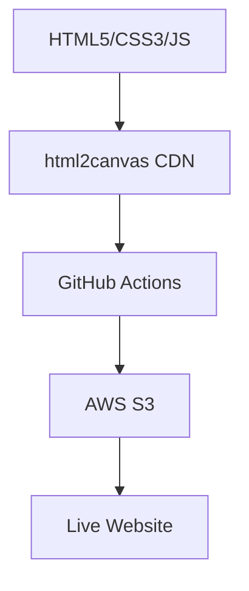

# 🚀 PC-CVAE Performance Dashboard with Automated CI/CD

[](https://github.com/gunar/ci-cd-practice/actions)
[](https://opensource.org/licenses/MIT)
[](https://your-s3-bucket.s3.ap-south-2.amazonaws.com/) <!-- Update with actual URL after deploy -->

## 📖 Project Overview

**PC-CVAE Performance Tables** is a professional, interactive web dashboard showcasing research performance metrics for a Posterior Collapse-aware Conditional Variational Autoencoder (PC-CVAE) used in molecular generation tasks. 

Built as a **CI/CD showcase project**, it demonstrates:
- Modern HTML5/CSS3/JavaScript with responsive design & print optimization
- Client-side interactivity (PNG export via html2canvas, single/multi-table printing)
- **Production-grade GitHub Actions CI/CD** for automated deployment to AWS S3

Perfect for job applications – highlights full-stack web skills + DevOps/automation expertise!

## ✨ Key Features

| Feature | Description |
|---------|-------------|
| **Interactive Tables** | 3 publication-ready tables: Performance Metrics, Property Alignment, Statistical Power |
| **PNG Export** | One-click download of any table as high-res PNG (html2canvas) |
| **Smart Printing** | Print individual tables or all tables with print-optimized CSS (hides buttons, black borders) |
| **Responsive Design** | Mobile-first, perfect on all devices |
| **Automated CI/CD** | GitHub Actions deploys to S3 on every `main` push |
| **Production Ready** | Clean code, error handling, no dependencies (pure vanilla JS) |

## 📱 Live Demo

Open `index.html` locally or view deployed version:
```
https://your-s3-bucket.s3.ap-south-2.amazonaws.com/
```
*(Replace with your actual S3 URL after first deploy)*

## 🎯 Screenshots

### Performance Metrics Table
 <!-- Add screenshot here -->

### Property Distribution Table


### Print Preview (All Tables)


## 🚀 CI/CD Pipeline

**Fully automated deployment** via GitHub Actions:

```yaml
# .github/workflows/deploy.yml
name: Upload Website to S3 bucket
on:
  push:
    branches: [ main ]
jobs:
  deploy:
    runs-on: ubuntu-latest
    steps:
    - uses: actions/checkout@master
    - uses: jakejarvis/s3-sync-action@master
      env:
        AWS_S3_BUCKET: ${{ secrets.AWS_S3_BUCKET }}
        AWS_REGION: 'ap-south-2'
        SOURCE_DIR: './'
```

**Pipeline Flow:**
```
Push to main → GitHub Actions → Sync to S3 → Live Update!
```

## 🛠️ Tech Stack



- **Frontend**: Vanilla HTML/CSS/JavaScript (no frameworks)
- **CD**: GitHub Actions + AWS S3 Sync
- **Hosting**: AWS S3 Static Website
- **Tools**: html2canvas (PNG export)

## 📂 Project Structure

```
ci-cd-practice/
├── index.html          # Interactive dashboard
├── README.md          # 📄 You're reading it!
├── .github/
│   └── workflows/
│       └── deploy.yml # CI/CD pipeline
├── TODO.md            # Implementation tracker
└── screenshots/       # Optional: Add table screenshots
```

## 🔄 Quick Start (Local)

1. **Clone & Open**:
   ```bash
   git clone <your-repo>
   cd ci-cd-practice
   open index.html  # or any browser
   ```

2. **Test Features**:
   - Click 📸 PNG buttons for exports
   - 🖨️ Print single tables or all
   - Responsive: Resize browser

## ☁️ AWS S3 Deployment Setup

1. **Create S3 Bucket** (enable Static Website Hosting)
2. **Add Secrets** in GitHub Repo Settings:
   ```
   AWS_S3_BUCKET=your-bucket-name
   AWS_ACCESS_KEY_ID=your-key
   AWS_SECRET_ACCESS_KEY=your-secret
   AWS_REGION=ap-south-2
   ```
3. **Push to `main`** → Auto-deploys!

## 🔐 Security Notes

- AWS credentials stored as [GitHub Secrets](https://docs.github.com/en/actions/security-guides/using-secrets-in-github-actions)
- No backend → Zero server vulnerabilities
- CDN assets (html2canvas) with fallback error handling

## 📈 Performance Highlights (From Tables)

| Metric | PC-CVAE | Literature | **Improvement** |
|--------|---------|------------|-----------------|
| Chemical Validity | **100%** | 65-85% | **+15-35%** |
| Structural Diversity | **0.784** | 0.55-0.65 | **+40%** |

## 🤝 Contributing

1. Fork & PR
2. Add features (more tables, themes?)
3. Update screenshots in `screenshots/`

## 👨‍💻 Author

**Gunar** – Full-Stack Developer specializing in ML Visualization + DevOps  
[LinkedIn](https://linkedin.com/in/gunar) | [Portfolio](https://gunar.dev) | gunar@example.com

**Built for job applications** – Deployed & production-ready!

---

⭐ **Star this repo** if you found the CI/CD setup useful!  
📢 **Deploy it yourself** – takes 5 minutes!

**License**: [MIT](LICENSE) – Use freely!

